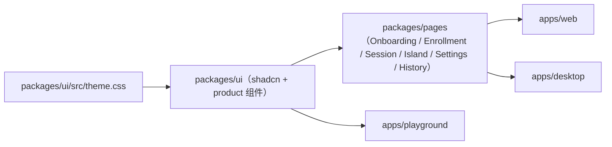

# 产品设计系统（tokens + 组件清单）

- **状态**：已落地——本文档描述 `packages/ui` 现状，不是待办
- **性质**：**记录**，不是决策文档；token/组件如有变化，改代码后回来同步本文，而不是先改文档再改代码
- **范围**：`packages/ui/src/theme.css` + `packages/ui/src/components/{ui,product}` — `apps/playground`、`apps/web`、`apps/desktop` 共用同一份
- **预览**：`pnpm dev:ui` 启动 Storybook（`apps/ui-kit/stories`），包含全部组件、
  Design Tokens 与生产页面（含假会话状态）；不需要 `.env` 或后端
- **关联**：
  - [Playground 视觉重构 spec](./playground-visual-refactor.md)（视觉决议的原始讨论）
  - [桌面 Island 头脑风暴](../brainstorm/2026-07-24-desktop-island-and-reply-stickies.md)
  - `prototypes/product-style-direction.html`（token 与组件视觉的原型来源，一次性草稿，不再维护）
  - `docs/plan`（`design_system_to_web_and_desktop`）落地本文档所述内容

## 1. 一句话

黄色、扁平、药丸形——「纸感便利贴」视觉语言现在只有**一份**代码来源：`packages/ui/src/theme.css`。`apps/playground`、`apps/web`、`apps/desktop` 的 `index.css` 都只是 `@import` 这份文件，不再各自维护 `:root`。

## 2. Design tokens（`packages/ui/src/theme.css`）

### 2.1 颜色

| Token | 说明 |
|-------|------|
| `--primary` / `--primary-foreground` | 品牌黄（Tailwind `yellow-400`），墨黄字（`yellow-900`）——CTA、开关开态、激活态统一用它，不单独定义"重要按钮"色阶 |
| `--primary-soft-strong` | 软黄表面（chip/pill-tag/icon-btn）的 hover 态，`yellow-200` |
| `--accent` / `--accent-foreground` | 软黄底（chip/pill-tag/icon-btn 常态），`yellow-100` / `yellow-800` |
| `--background` / `--card` / `--secondary` / `--muted` / `--border` / `--input` / `--ring` | 常规浅色纸面 token，暗色模式下有对应 `.dark` 覆盖 |
| `--desk` | 便利贴堆叠所在的"桌面"底色（playground 悬浮模拟区、Island dock 背景） |
| `--sticky-foreground` | 便利贴上的墨色文字，亮/暗模式下**固定**为暖棕色，不随主题反相（便利贴永远亮黄纸+深墨字） |
| `--island` / `--island-foreground` | 桌面 Island 的暗色玻璃底，独立于页面亮暗主题 |

### 2.2 阴影分级（"selectable token"共用语法）

所有**可选中/切换的控件**（chip、seg、switch、icon-btn、pill-tag、btn）共享同一套扁平阴影语法，不允许再发明第三档：

| Token | 用途 |
|-------|------|
| `--shadow-tier0` | 常态（未选中/未激活） |
| `--shadow-tier1` | 选中/激活态（小尺寸） |
| `--shadow-tier1-lg` | 选中/激活态（大按钮、主 CTA） |
| `--shadow-panel` | 面板级容器（工具条、侧栏、对话框） |
| `--shadow-note` | 便利贴卡专用（更大扩散，暖色调）——`.island-stage` 作用域内会覆盖为更轻的版本，见 §2.5 |

三档均为**纯色彩/对比度表达状态**，禁止用 `translateY` 或多层描边模拟厚度——切换态靠颜色深浅、不靠"浮起/压下"的立体感。

### 2.3 圆角

`--radius`（15px 基准）通过 shadcn 惯例派生 `--radius-sm/md/lg/xl`；按钮与 pill 类控件直接用 `rounded-full`，不走这套圆角阶梯。

### 2.4 动效

`--ease-out-soft`（`cubic-bezier(0.22, 1, 0.36, 1)`）是唯一的减速缓动 token——便利贴入场/顶替/弱化、卡片按压反馈等都应引用它，不要各写各的 `ease-in`/`linear`。遵循 `prefers-reduced-motion`。

### 2.5 Utility 类（`@layer utilities`）

| 类 | 用途 |
|----|------|
| `.paper-sheet` / `.product-stage` | 纸感面板容器（工具条、侧栏、对话框） |
| `.desk-surface` | 便利贴堆叠所在的桌面底 |
| `.island-bar` | 桌面 Island 暗色玻璃工具条——**无常驻阴影**（漂浮在透明桌面上，大范围模糊阴影会显得像一块脱节的黑斑）；边框常态几乎不可见，仅 `:hover` 时变亮，提示"这里可交互" |
| `.glass-chip` | Island 实时字幕条——同一玻璃家族，药丸形、无阴影 |
| `.sticky-note` / `.sticky-note-placeholder` / `.sticky-note-interactive` | 便利贴卡本体与交互态（playground / apps/web：不透明页面背景之上，保留完整纸感阴影） |
| `.island-stage` | 包一层在 `IslandPage`（及 playground 悬浮预览）外层，把其内 `.sticky-note` 的阴影降级为轻量版 + 边框仅 hover 显现——同一张卡在"漂浮在桌面上" vs "铺在纸面舞台上"两种语境下阴影语义不同，靠这层作用域类区分，不新增卡片变体 |

## 3. shadcn 基础组件（`packages/ui/src/components/ui/`）

现有 23 个：`accordion`、`badge`、`button`、`card`、`collapsible`、`dialog`、`dropdown-menu`、`input`、`label`、`popover`、`progress`、`scroll-area`、`select`、`separator`、`sheet`、`skeleton`、`slider`、`sonner`（Toaster/toast）、`switch`、`tabs`、`textarea`、`toggle`、`toggle-group`、`tooltip`。

改样式改这些源文件（如 `button.tsx` 的 `cva` variants），不要在 `apps/*` 里平行重造一套。缺组件先 `shadcn add` 进本包再导出——见 AGENTS.md。

### 3.1 `Button` variants

`default`（主 CTA，`--shadow-tier1-lg` + 黄色渐变面）、`soft`（常显软黄二级操作）、`ghost`、`outline`、`secondary`、`destructive`、`link`。大小按钮共享同一套渐变面，没有为"更重要的按钮"单开一档。

### 3.2 `ToggleGroup` / `ToggleGroupItem`

一个组件覆盖两种视觉上等价的场景：语言选择的 chip 行（`variant="chip"`，每项等宽撑满）与水平/等级的分段控件（默认 `variant`，胶囊底 + 选中态浮起）。原型中曾是两套实现（chip / seg），现在统一成一个，避免重复。

## 4. 产品专属组件（`packages/ui/src/components/product/`）

| 组件 | 用途 | 备注 |
|------|------|------|
| `StickyNoteCard` / `StickyNoteCardPlaceholder` | 单条回复候选的便利贴卡面 | props 直接对齐 `@kibotalk/conversation` 的 `ReplyCandidate`/`ReplySegment`，不重新定义 schema |
| `StickyNoteStack` | 一轮（或多轮）候选的堆叠列表 | 承载"通知中心式多轮候选"逻辑：新轮在上、旧轮弱化、`maxRounds` 截断、空态/流式骨架 |
| `IslandBar` + `IslandStatus` / `IslandSeparator` / `IslandToggleButton` / `IslandNavButton` / `IslandDragHandle` | 桌面 Island 的悬浮控制条 | `IslandToggleButton` 只承载 AI 建议等真实开关；运行即转写，不再显示转写开关。容器不可整体拖动，只有带四向箭头的 `IslandDragHandle` 使用 `[-webkit-app-region:drag]` |
| `StepIndicator` | 声纹录入向导的步骤指示 | 三步：说明 → 录入 → 完成确认 |
| `SessionListItem` | 历史会话列表的一行 | 由 `HistoryPage` 使用；列表与详情响应式切换，详情显示转写、候选和后台总结状态 |
| `PillTag` | 通用药丸标签 | 例如"仅桌面端"一类的能力标记 |

## 5. 谁在用

`apps/playground` 直接消费 `packages/ui` 的 token 与基础组件（实验室密度更高，但同一套纸感/黄色语言）；`apps/web`、`apps/desktop` 通过 `packages/pages` 的产品页面间接消费，不重新拼装。

## 6. 非目标

- 不是决议记录——视觉决策的来龙去脉见 [Playground 视觉重构 spec](./playground-visual-refactor.md) 与桌面头脑风暴文档。
- 不定义业务状态机或存储 schema；会话、历史、设置锁定与权限行为以 MVP spec 和跨端决策文档为准。
